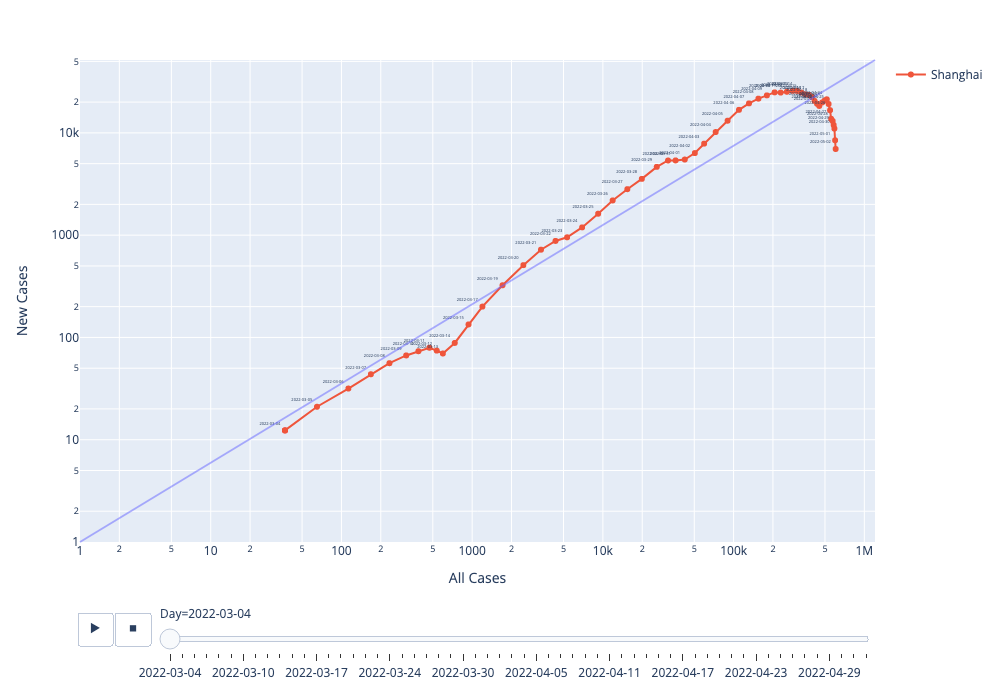

# # Visualization of current COVID-19 trend in Shanghai

The visualization method is based on MinutePhysics' video [here](https://www.youtube.com/watch?v=54XLXg4fYsc).

Data depends on the work of [@kekincai](https://github.com/kekincai), downloaded from the deployed app available [here](https://kapaul.shinyapps.io/shanghai_covid19/).

